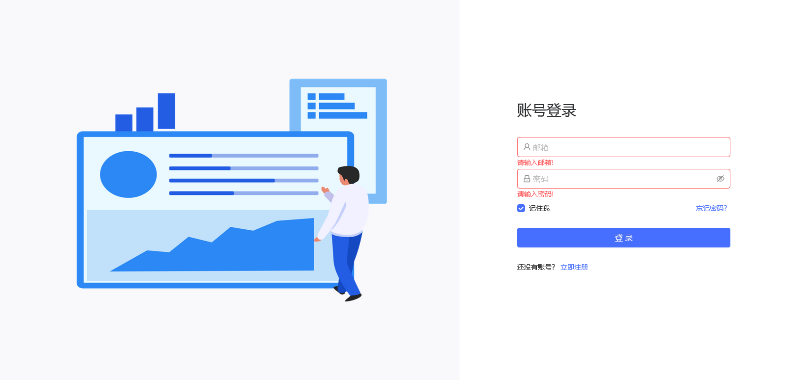
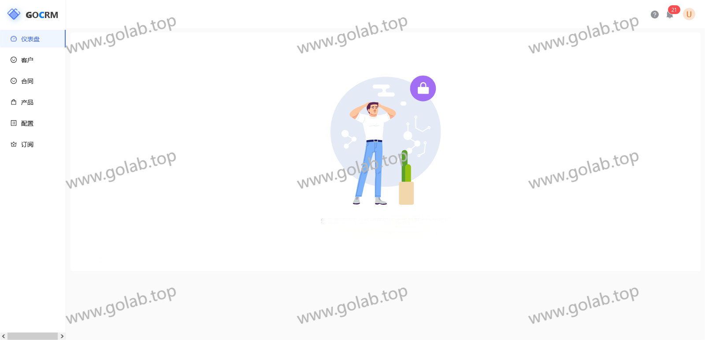
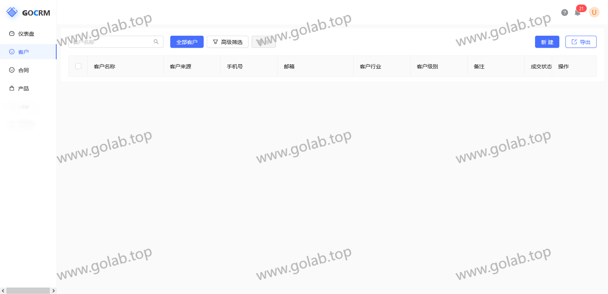
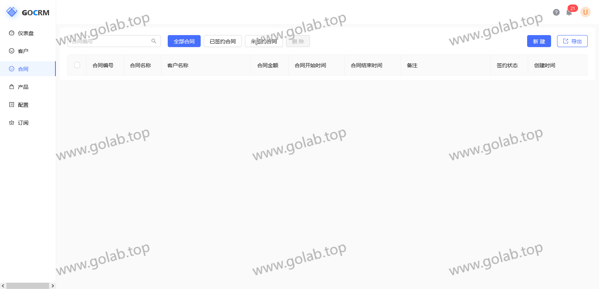
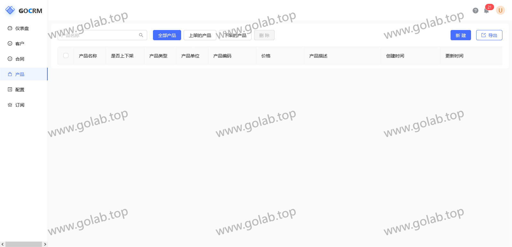

# 一、系统概述

gocrm 是一个基于GO+VUE的一个GO基座项目.

拥有最基础的客户管理、合同管理、产品管理功能。
## 1、客户管理：
客户名称、客户来源	、手机号	、邮箱	、客户行业	、客户级别	、备注、	成交状态	、详细地址、	创建时间、	更新时间	、操作
## 2、合同管理：
合同编号	、合同名称、	客户名称、合同金额、	合同开始时间、	合同结束时间、	备注、	签约状态、	创建时间	

## 3、产品管理
产品名称	、是否上下架、	产品类型、	产品单位、	产品编码、	价格	、产品描述	、创建时间	、更新时间 

# 二、界面UI展示

## 1、登录页

## 2、仪表盘

## 3、客户管理

## 4、合同管理

## 5、产品管理

# 三、定制热线
若有兴趣，可一起交流；
若有此类定制需求，也可联系沟通具体。

**联系方式：**

